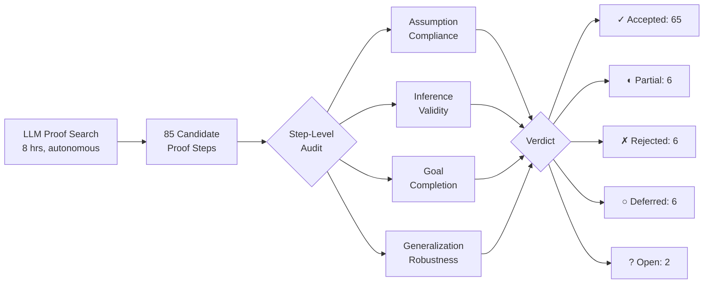
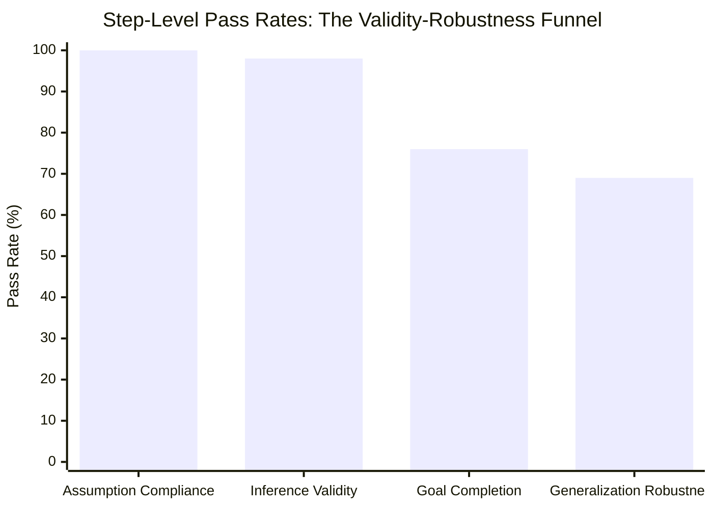
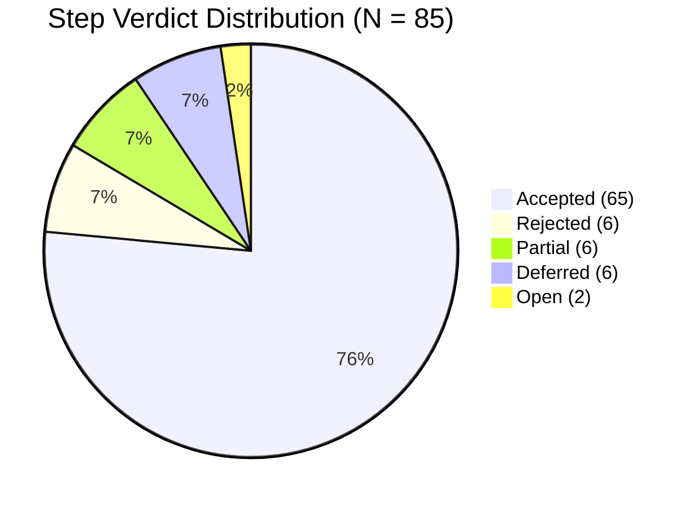
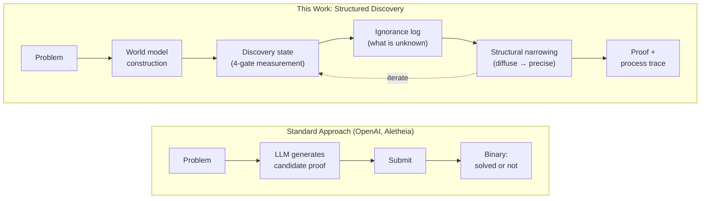
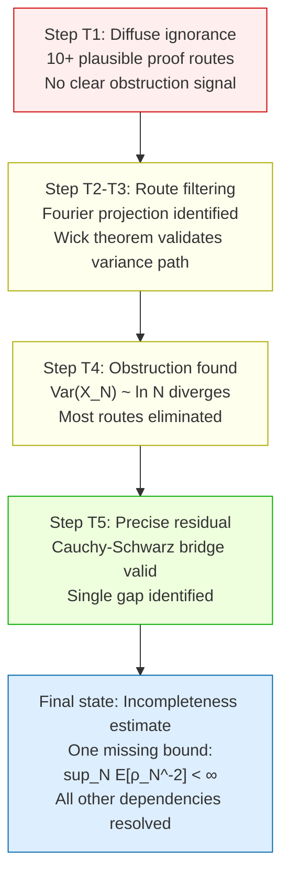
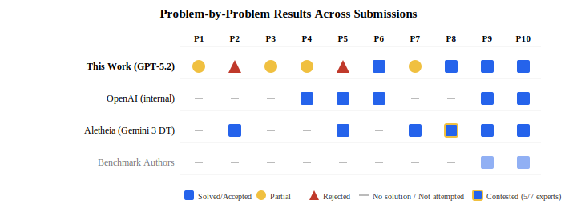
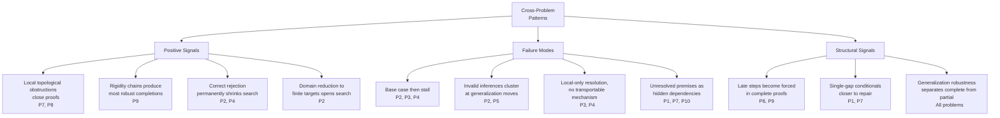
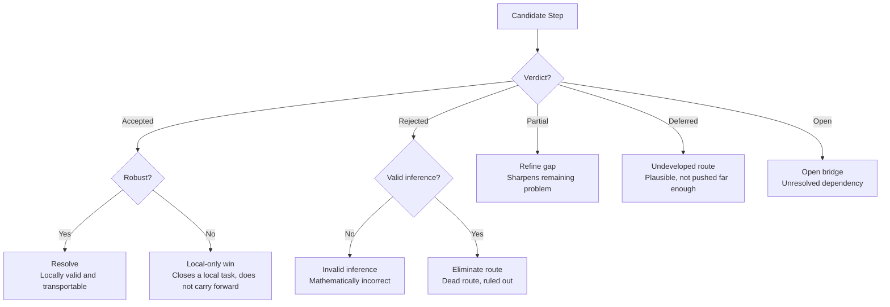

<div align="center">

# Analysis of Synthetic Discovery of Math Proofs

**Autonomous Proof Discovery Pilot on Harvard's First Proof Benchmark, Public Dataset**

[]() []() []() []() [](LICENSE)

[](https://doi.org/10.5281/zenodo.18629234)

*Our proofs and solutions were archived at the DOI above before official solutions were released. This repository contains the full audited results: GPT-5.2 API, 8 hours, ~$32 compute cost, zero human intervention.*

</div>

---

### Key Result

The defining empirical signal of this pilot is the gap between local correctness and robust transfer. Inference validity stands at 98%; generalization robustness at 69%. That 29 percentage-point drop is the core finding. The model rarely produces invalid mathematics. Most failures occur when a locally valid argument does not survive expansion from a special case to the full target.

### Originality

This is a process-level dataset, not a final-answer benchmark. It preserves the full proof-search structure: accepted steps, rejected routes, deferred mechanisms, and explicit open bridges. Negative evidence (route eliminations, counterexamples, dead-end documentation) is treated as first-class output.

### What This Dataset Provides

- 85 audited proof steps with four binary quality metrics and human review notes
- 6 rejected routes (4 self-rejected by the model, 2 caught by audit), each permanently eliminating a proof family
- Cross-problem patterns yielding falsifiable hypotheses about when AI proof search succeeds or fails
- A closed-loop measurement framework reusable for future AI proof discovery evaluation

> <sub>*The discovery protocol is a pilot application of a formal theory of structured inquiry that treats proof search as navigation over an explicit ignorance partition. The four measurement gates, the ignorance log, and the narrowing dynamics each derive from primitives in this framework. The epistemic state counter agent in `code/` implements the state tracking during the autonomous run. This is part of a larger body of ongoing work on synthetic discovery.*</sub>

---

## Table of Contents

- [Audit Pipeline](#audit-pipeline)
- [Problems Attempted](#problems-attempted)
- [Step-Level Metrics](#step-level-metrics)
- [Verdict Distribution](#verdict-distribution)
- [Sample Theorems](#sample-theorems)
- [Proof Highlights](#proof-highlights)
- [Method and Context Within the First Proof Ecosystem](#method-and-context-within-the-first-proof-ecosystem)
- [Cross-Problem Patterns](#cross-problem-patterns)
- [Search Role Taxonomy](#search-role-taxonomy)
- [Repository Structure](#repository-structure)
- [Dataset Workbook Guide](#dataset-workbook-guide)
- [Metric Definitions](#metric-definitions)
- [Implications](#implications)
- [License](#license)

---

## Audit Pipeline

The pilot follows a fixed pipeline: autonomous proof search, then independent post-hoc audit through four gates, then proof-level rollup. The audit was conducted by the authors' group and cross-validated by an LLM council (Claude Opus 4.6, GPT-5.4 Pro, Gemini 3 Pro).



| Parameter | Value |
|---|---|
| **Model** | GPT-5.2 |
| **Infrastructure** | Consumer API (GPT-5.2) |
| **Compute cost** | ~$32 |
| **Runtime** | 8 hours, unattended |
| **Human intervention** | None during the run |
| **Post-hoc audit** | Authors' group + LLM council (Claude Opus 4.6, GPT-5.4 Pro, Gemini 3 Pro) |

---

## Problems Attempted

Ten problems spanning ten distinct areas of mathematics.

| # | Problem | Area | Outcome |
|---|---------|------|---------|
| 1 | Singularity of the $\Phi^4_3$ measure under smooth translations | Quantum field theory | 🟡 Partial |
| 2 | Local test vector for Rankin-Selberg integrals on $\mathrm{GL}_{n+1} \times \mathrm{GL}_n$ | Automorphic forms | 🔴 Rejected |
| 3 | Markov chain with interpolation ASEP/Macdonald stationary weights at $q = 1$ | Probability & algebraic combinatorics | 🟡 Partial |
| 4 | Finite free Stam inequality for $\Phi_n(p \boxplus_n q)$ | Free probability | 🟡 Partial |
| 5 | $\mathcal{O}$-slice connectivity and geometric fixed points | Equivariant homotopy theory | 🔴 Rejected |
| 6 | Schur-complement certificates for $\varepsilon$-light vertex sets | Spectral graph theory & algorithms | 🟢 **Accepted** |
| 7 | Obstructions to $\mathbb{Q}$-acyclic universal covers for lattices with involutions | Topology & geometric group theory | 🟡 Partial |
| 8 | Quadrivalent polyhedral Lagrangian surfaces in $\mathbb{R}^4$ need not admit smoothings | Symplectic topology | 🟢 **Accepted** |
| 9 | Polynomial certificate for rank-one scaling of determinantal block tensors | Algebraic geometry & tensor methods | 🟢 **Accepted** |
| 10 | Matrix-free PCG for the mode-$k$ RKHS subproblem with Kronecker structure | Numerical linear algebra & kernel methods | 🟢 **Accepted** |

**Summary.** 4 accepted theorem-level proofs, 4 partial proofs with structural progress, 2 rejected.


---

## Step-Level Metrics

85 candidate proof steps were audited against four binary gates. Each step either passes (1) or fails (0) on each gate.

| Metric | Rate | Fraction | Note |
|--------|------|----------|------|
| **Assumption compliance** | $100\%$ | $85/85$ | Every step stayed within the stated hypotheses |
| **Inference validity** | $98\%$ | $83/85$ | Only 2 steps contained a mathematical error |
| **Goal completion** | $76\%$ | $65/85$ | Most steps are directionally useful; some stop short of closure |
| **Generalization robustness** | $69\%$ | $59/85$ | The main bottleneck: locally valid steps that fail to transport |

The four rates form a monotone funnel. The 29-point drop from inference validity to generalization robustness is the core empirical finding.



---

## Verdict Distribution

Each step receives exactly one verdict. The distribution:



| Verdict | Count | Share | Meaning |
|---------|-------|-------|---------|
| Accepted | 65 | 76% | Valid and goal-complete at the claimed scope |
| Rejected | 6 | 7% | Ruled out by counterexample or invalid inference |
| Partial | 6 | 7% | Promising, but with an unresolved subgoal or missing premise |
| Deferred | 6 | 7% | Plausible but insufficiently developed to judge |
| Open | 2 | 2% | Explicit unresolved bridge statement or conjecture |

---

## Sample Theorems

Representative formal statements from the pilot, rendered in the notation of the original proofs.

### Problem 1: $\Phi^4_3$ Measure Singularity (Partial)

Let $\mu$ be the $\Phi^4_3$ measure on $\mathcal{D}'(\mathbb{T}^3)$. For any nonzero $\psi \in C^\infty(\mathbb{T}^3)$, define the shift $T_\psi(u) = u + \psi$.

$$\mu \;\perp\; (T_\psi)_*\mu$$

The proof proceeds by contradiction: assuming quasi-invariance, the logarithmic derivative $B_\psi$ must lie in $L^2(\mu)$, but the variance of the cubic smearing $X_N = \int_{\mathbb{T}^3} {:}\, u_N^3 {:}\, \psi \, dx$ diverges as $\ln N$ via Wick's theorem. Four of five steps are clean. The sole gap is a negative-moment bound $\sup_N \mathbb{E}_{\mu_N}[\rho_N^{-2}] < \infty$ that is invoked but not established.

### Problem 4: Finite Free Stam Inequality (Partial)

For monic real-rooted polynomials $p, q$ of degree $n$, with finite free convolution $p \boxplus_n q$ and root-gap functional $\Phi_n$:

$$\frac{1}{\Phi_n(p \boxplus_n q)} \;\geq\; \frac{1}{\Phi_n(p)} + \frac{1}{\Phi_n(q)}$$

where $\Phi_n(p) := \sum_{i \leq n} \left(\sum_{j \neq i} \frac{1}{\lambda_i - \lambda_j}\right)^{\!2}$ and $\lambda_1, \ldots, \lambda_n$ are the roots.

The $n \leq 3$ case is closed via additive invariants and a Jensen convexity argument. The semigroup interpolation route (fractional $\boxplus_n$-powers) is ruled out: a counterexample shows real-rootedness is not preserved for $t \in (0,1)$.

### Problem 6: Schur-Complement Certificates (Accepted)

For a graph $G = (V, E)$ with Laplacian $L$, a set $S \subseteq V$ is $\varepsilon$-light if $\varepsilon L - L_S \succeq 0$. The proof establishes:

$$S \text{ is } \varepsilon\text{-light} \quad\iff\quad \tilde{L}_S \preceq \varepsilon \, L_S^{\text{Schur}}$$

where $L_S^{\text{Schur}} = A - BC^\dagger B^\top$ is the generalized Schur complement. An explicit counterexample (a path with pendant stars) shows that raw edge-count conditions are insufficient, justifying the effective-conductance formulation.

### Problem 8: Lagrangian Smoothing Obstruction (Accepted)

In $(\mathbb{R}^4, \omega = dx_1 \wedge dy_1 + dx_2 \wedge dy_2)$, the product torus $K = C_1 \times C_2$ of two square boundaries is a quadrivalent polyhedral Lagrangian surface. At the right-angle vertex $v$, the canonical Gauss-map loop has Maslov index:

$$\mu(\gamma_v) = 2(k_1 + k_2) = 4 \neq 0$$

Any Lagrangian smoothing would produce a smooth disk near $v$ with $\mu = 0$ (by null-homotopy), contradicting the above. The obstruction is purely local.

### Problem 9: Rank-One Scaling Certificate (Accepted)

Fix $n \geq 5$ and Zariski-generic $A^{(1)}, \ldots, A^{(n)} \in \mathbb{R}^{3 \times 4}$. Define the determinantal block tensor $Q_{ijkl}^{(\alpha\beta\gamma\delta)} = \det(a^{(\alpha,i)}, a^{(\beta,j)}, a^{(\gamma,k)}, a^{(\delta,\ell)})$ and observed blocks $T = \lambda \cdot Q$. The polynomial test $F(\mathcal{T})$ (flattening 5-minors + slice 3-minors) satisfies:

$$F(\mathcal{T}) = 0 \quad\iff\quad \lambda_{\alpha\beta\gamma\delta} = u_\alpha \, v_\beta \, w_\gamma \, x_\delta$$

The proof chain: flattening rank $\leq 4$ yields a Tucker decomposition; slice rank $\leq 2$ constrains the core; projective-geometry rigidity forces the core into the Levi-Civita orbit; the block-scaling endgame collapses each factor to a scalar.

---

## Proof Highlights

### Accepted Proofs

<details>
<summary><strong>Problem 6: Schur-complement certificates for light vertex sets</strong></summary>

A clean end-to-end proof. The Schur-complement characterization $\tilde{L}_S \preceq \varepsilon L_S^{\text{Schur}}$ gives the variational identity, a two-layer bridging bound provides a computable lower bound on the effective cut functional, and an explicit graph counterexample rules out the raw cut-test. All steps accepted, all metrics at ceiling.

</details>

<details>
<summary><strong>Problem 8: Lagrangian smoothing obstruction</strong></summary>

A local Maslov-index computation at the product vertex $v = (0,0,0,0)$ yields $\mu(\gamma_v) = 4 \neq 0$. Any Lagrangian smoothing would produce, via ambient topological isotopy, a smooth Lagrangian disk near $v$ with vanishing Maslov index. Contradiction. The argument is purely local and does not require global Hamiltonian machinery.

</details>

<details>
<summary><strong>Problem 9: Rank-one scaling certificate</strong></summary>

The most robust completion in the pilot. A deep rigidity chain: flattening minors give a Tucker decomposition with $4 \times 4$ core; slice minors constrain every two-mode core slice to rank $\leq 2$; a projective-geometry bridge (the fundamental theorem of projective geometry in the needed special form) forces the core into the determinant orbit; the block-scaling endgame shows each block action collapses to a scalar, yielding rank-one $\lambda$.

</details>

### Notable Partial Results

<details>
<summary><strong>Problem 1: $\Phi^4_3$ measure singularity</strong></summary>

Four of five steps are clean, including the $\mathrm{Var}_{\nu_N}(X_N) \sim \ln N$ divergence. The Cauchy-Schwarz bridge (inverse density argument) is algebraically valid but requires $\sup_N \mathbb{E}_{\mu_N}[\rho_N^{-2}] < \infty$, which is invoked without proof. A single-gap conditional: repair the negative-moment bound and the proof closes.

</details>

<details>
<summary><strong>Problem 2: Rankin-Selberg local test vectors</strong></summary>

The $\mathrm{GL}_2 \times \mathrm{GL}_1$ base case closes completely via explicit Gauss sums. The monomiality criterion (Lemma 2) reduces the problem to shell isolation: the Rankin-Selberg integral must collapse to a single power of $q^{-s}$. Two validated diagonal-restriction constructions exist, but the bridge lemma connecting diagonal control to the full integral remains open.

</details>

<details>
<summary><strong>Problem 7: $\mathbb{Q}$-acyclic universal covers</strong></summary>

The obstruction chain is strong: $\mathbb{Q}$-acyclicity of the universal cover forces $\chi(\Gamma) = \chi(M) \in \mathbb{Z}$; a lattice $\Gamma < PU(2,1)$ with an involution has $\chi(\Gamma) = 63/2 \notin \mathbb{Z}$; contradiction. The gap: the specific ball-quotient surface with $e(S) = 63$ and the required involution is cited but not constructed in the proof.

</details>

---

## Method and Context Within the First Proof Ecosystem

### The First Proof Benchmark

The [First Proof](https://arxiv.org/abs/2602.05192) benchmark was created by 11 mathematicians: Abouzaid (Stanford), Blumberg (Columbia), Hairer (EPFL/Imperial), Kileel (UT Austin), Kolda (MathSci.ai), Nelson (Aarhus), Spielman (Yale), Srivastava (UC Berkeley), Ward (UT Austin), Weinberger (UChicago), and Williams (Harvard). The group includes a Fields Medalist and two MacArthur Fellows. Problems were released February 5, 2026, with solutions encrypted until February 13. Each problem is a genuine research lemma from the authors' own unpublished work, sampling the true distribution of questions working mathematicians face.

### Our Method: Structured Discovery State Tracking

The key contribution of this work is not the choice of model but the approach. We ran GPT-5.2 via consumer API access (~$32 total compute cost for the full 8-hour run across all 10 problems), but treated each proof attempt as a **world model** and imposed a structured discovery protocol on top of it.

The protocol has three components:

**1. Four-gate measurement at every step.** Each candidate proof step is scored on assumption compliance, inference validity, goal completion, and generalization robustness. These measurements are not post-hoc; they are tracked in real time during the search, standardizing the discovery state across all 10 problems.

**2. Structured ignorance logging.** The system maintains an explicit record of what the model knows it does not know. This includes unverified premises, unresolved bridge lemmas, untested generalization paths, and conditional dependencies. The log is not a list of failures; it is a map of the current boundary of knowledge.

**3. Ignorance narrowing.** Across the proof search, the structure of ignorance changes. The system tracks this evolution: from diffuse uncertainty (many plausible routes, no clear obstruction) to precise hypothesis spaces (a single identified gap with known boundary conditions) to incompleteness estimates (a quantified statement of what remains).



The practical consequence: even when a proof does not close, the output is not a failed attempt but a structured residual, a precise characterization of what remains unknown and why prior routes were eliminated. Six rejected routes in this pilot are not wasted compute; they are permanent boundary information.

### Ignorance Evolution: An Example

Problem 1 ($\Phi^4_3$ measure singularity) illustrates the narrowing process across five audited steps:



The proof starts with diffuse ignorance (many plausible routes) and ends with a single, precisely identified missing premise. This structured residual is reusable: any future system attempting P1 can start from the precise gap rather than repeating the full search.

### Landscape of Submissions

Several groups engaged with the First Proof benchmark, each contributing differently. OpenAI and Google DeepMind demonstrated frontier model capability on research-level proofs. The benchmark authors established a public-model baseline. This work contributes a complementary dimension: a structured discovery framework that produces auditable process data, not just final proofs.



| Dimension | This Work | OpenAI | Aletheia (Google) | Benchmark Authors |
|-----------|-----------|--------|-------------------|-------------------|
| **Model** | GPT-5.2 (consumer API) | Internal (unreleased) | Gemini 3 Deep Think | ChatGPT 5.2 Pro + Gemini 3.0 DT |
| **Focus** | Discovery framework | Proof generation | Autonomous proof agent | Baseline testing |
| **Human supervision** | None | Limited (semi-autonomous) | None (fully autonomous) | N/A (testing) |
| **Compute cost** | ~$32 | Not disclosed | Not disclosed | Not disclosed |
| **Problems solved** | 4/10 | 5/10 | 6/10 | 2/10 |
| **Process data released** | Yes (85 audited steps) | Proofs only | Proofs only | N/A |
| **Negative evidence preserved** | Yes (6 rejected routes) | No | Partial (4 "no solution") | No |

### Problem-by-Problem Analysis

**Problems solved by all systems that attempted them (P9, P10).** These are the most tractable problems. Even the benchmark authors solved them using public models. P9 (rank-one scaling certificate) produced the most robust completion in our pilot, dominated by a rigid chain of overdetermined structural lemmas.

**P6: solved by us and OpenAI, not by Aletheia.** Aletheia returned "no solution" on P6 (Schur-complement certificates). Our proof is a clean end-to-end argument. OpenAI also solved it, though Pachocki noted that the rollout was prompted with guidance to use "a BSS barrier type argument," raising questions about the degree of autonomy.

**P2, P5: rejected by us, solved by Aletheia.** Our system identified inference validity failures in both problems. For P2 (Rankin-Selberg), the recurrence-based shell isolation operator was found to kill the full sequence including the base term. For P5 (O-slice), the forward direction relies on a monotonicity step that fails for incomplete transfer systems. Aletheia's solutions to these problems were accepted by expert majority, suggesting either a different proof route or a correct resolution of the issues our audit flagged.

**P7: solved only by Aletheia.** This problem (Q-acyclic universal covers) was described as "atypical, open for several years." Our pilot produced a strong obstruction chain but could not establish the existence premise (a specific ball-quotient surface). Aletheia's inference cost for P7 was an order of magnitude higher than typical.

**P1, P3, P4: unsolved by all autonomous systems.** No fully autonomous system solved these three. OpenAI solved P4 (finite free Stam inequality) with human supervision. Our pilot produced partial results on all three, with the strongest being P1, where four of five steps are clean and a single missing bound is the sole remaining gap.

**P8: solved by us and Aletheia (contested).** Our Maslov-index computation is a clean local obstruction. Aletheia's solution was accepted by 5 of 7 experts but was the only non-unanimous result in their submission.

### Complementary Contribution

This work does not aim to compete on the number of problems solved. On that metric, Aletheia leads (6/10) and OpenAI follows (5/10), both demonstrating impressive frontier capability. The contribution here is orthogonal: it is about the structure of the output, not its quantity.

OpenAI and Aletheia produced high-quality final proofs. This work complements those results by providing a **structured discovery record** for every problem, including the ones that were not solved. The record contains:

1. **Audited step-level data** with four quality metrics per step, not just a final verdict
2. **Rejected routes with reasons**, permanently eliminating proof families for future work
3. **Precise incompleteness estimates**, characterizing what remains unknown and at what granularity
4. **Cross-problem patterns**, extracting falsifiable hypotheses about when and why proof search succeeds or fails

For the four partial proofs, any future system can start from the structured residual rather than repeating the full search from scratch.

---

## Cross-Problem Patterns

Falsifiable hypotheses extracted from the pilot, grounded in the audited trace. These are hypotheses generated from a 10-problem pilot, not validated findings. We present them as falsifiable predictions for future benchmark iterations.



| Pattern | Type | Evidence | Testable Implication |
|---------|------|----------|---------------------|
| Local topological obstructions close proofs | Positive | P7, P8 | Higher completion rates when a rigid local invariant is available |
| Rigidity chains produce the most robust completions | Positive | P9 | Proofs dominated by rigidity lemmas should have highest robustness |
| Correct rejection permanently shrinks search | Positive | P2, P4 | Route-elimination counts should correlate with eventual completion |
| Base case closes, mechanism fails to transport | Failure | P2, P3, P4 | Early local wins with low robustness should predict non-completion |
| Invalid inferences cluster at generalization moves | Failure | P2, P5 | Invalid steps should cluster at generalization, not at base cases |
| Late steps become forced in complete proofs | Structural | P8, P9 | Late-stage branch width should discriminate complete from partial |
| Single-gap conditionals closer to repair than strategy failures | Structural | P1, P7 | One-gap conditionals should convert at higher rates |

---

## Search Role Taxonomy

Each audited step is assigned a search role based on its verdict and quality profile.



---

## Repository Structure

```
.
├── README.md
├── LICENSE
├── assets/
│   ├── proof_outcomes.svg               # Quadrant chart of proof outcomes
│   └── comparison_grid.svg              # Problem-by-problem comparison across submissions
├── code/                                # Scripts and tooling
├── proofs/
│   ├── zetesis_proof_attempt_P1.pdf     # Phi^4_3 measure singularity
│   ├── zetesis_proof_attempt_P2.pdf     # Rankin-Selberg local test vector
│   ├── zetesis_proof_attempt_P3.pdf     # Markov chain construction
│   ├── zetesis_proof_attempt_P4.pdf     # Finite free Stam inequality
│   ├── zetesis_proof_attempt_P5.pdf     # O-slice connectivity
│   ├── zetesis_proof_attempt_P6.pdf     # Schur-complement certificates
│   ├── zetesis_proof_attempt_P7.pdf     # Q-acyclic universal covers
│   ├── zetesis_proof_attempt_P8.pdf     # Lagrangian smoothing obstruction
│   ├── zetesis_proof_attempt_P9.pdf     # Rank-one scaling certificate
│   └── zetesis_proof_attempt_P10.pdf    # Matrix-free PCG for RKHS
└── datasets/
    ├── first_proof_benchmark_results.xlsx       # Full audited dataset (formula-linked)
    ├── csv/                                     # Machine-readable CSV exports
    │   ├── tactic_data.csv                      # 85 audited steps with computed search roles
    │   ├── proof_summary.csv                    # Per-problem rollups with computed rates
    │   ├── aggregate_metrics.csv                # Workbook-level counts and rates
    │   ├── process_traces.csv                   # Curated high-leverage steps
    │   ├── cross_problem_patterns.csv           # Falsifiable hypotheses
    │   └── overview.csv                         # Pilot summary and metric dictionary
    └── yaml/                                    # Structured YAML for AI ingestion
        ├── tactic_data.yaml                     # 85 steps as typed objects with nested metrics
        ├── proof_summary.yaml                   # 10 proofs with computed rates and verdicts
        ├── aggregate_metrics.yaml               # Nested counts, rates, distributions, gap analysis
        ├── process_traces.yaml                  # High-leverage steps with contributions
        ├── cross_problem_patterns.yaml          # Patterns with evidence and testable implications
        ├── overview.yaml                        # Pilot summary, metric dictionary, verdict labels
        └── first_proof_benchmark_results.yaml  # All 6 sheets combined in one file
```

---

## Dataset Workbook Guide

<details>
<summary>The Excel workbook (<code>datasets/first_proof_benchmark_results.xlsx</code>) contains six sheets. Click to expand.</summary>

| Sheet | Contents |
|-------|----------|
| **Overview** | Pilot summary, novelty classification, metric dictionary, reading guide |
| **Tactic Data** | All 85 audited steps with four binary metrics, verdicts, search-role labels, review notes |
| **Proof Summary** | Formula-driven proof-level rollups: per-metric rates, rejection flags, overall outcome per problem |
| **Aggregate Metrics** | Workbook-level counts, rates, verdict distributions, search-role breakdowns, validity-vs-robustness gap |
| **Process Traces** | Curated high-leverage steps: what each contributed and what boundary information it produced |
| **Cross-Problem Patterns** | Falsifiable hypotheses with evidence pointers and testable implications |

> [!TIP]
> All counts and rates in the workbook are formula-linked to the tactic and proof sheets. The workbook stays internally consistent under revision.

</details>

---

## Metric Definitions

Each step $i$ is scored on four binary gates. Let $N = 85$ be the total number of audited steps.

| Metric | Formal Definition | Rate |
|--------|-------------------|------|
| **Assumption compliance** | $a_i = \mathbb{1}[\text{step } i \text{ remains within stated hypotheses}]$ | $\bar{a} = \frac{1}{N}\sum_{i=1}^{N} a_i = 100\%$ |
| **Inference validity** | $v_i = \mathbb{1}[\text{the mathematics of step } i \text{ is correct as written}]$ | $\bar{v} = 98\%$ |
| **Goal completion** | $g_i = \mathbb{1}[\text{the local objective of step } i \text{ is achieved}]$ | $\bar{g} = 76\%$ |
| **Generalization robustness** | $r_i = \mathbb{1}[\text{step } i \text{ survives expansion to the full target}]$ | $\bar{r} = 69\%$ |

<details>
<summary><strong>Verdict Labels</strong></summary>

| Verdict | Definition |
|---------|------------|
| **Accepted** | Valid and goal-complete at the claimed scope |
| **Partial** | Promising, with an unresolved subgoal or missing premise |
| **Rejected** | Ruled out by counterexample or invalid inference |
| **Deferred** | Plausible but insufficiently developed to judge |
| **Open** | Explicit unresolved bridge statement or conjecture |
| **Mixed** | Algorithmic core accepted; one theoretical dependency remains partial |

</details>

---

## Implications

> [!IMPORTANT]
> **For AI and mathematics research:**
> - A commodity-hardware run with structured discovery tracking can produce auditable proof-search structure, not just candidate final answers
> - Route elimination is productive output; the model correctly self-rejected 4 of 6 dead routes
> - The validity-to-robustness gap is the primary target for improving AI proof discovery systems

**For future benchmarking:**
- Systems should be scored on route elimination, premise verification, and transport, not only proof completion
- Process-level datasets preserving search structure are more informative than binary success/failure labels
- Generalization robustness at mid-proof predicts completion better than inference validity alone

---

## License

See [LICENSE](LICENSE) for details. Apache 2.0.

---

## Citation

If you use this dataset or reference these results, please cite:

```bibtex
@misc{first_proof_benchmark_results,
  title        = {First Proof Benchmark Results: Autonomous Proof Discovery Pilot},
  author       = {Gupta, Dhruv and Samanway},
  year         = {2026},
  howpublished = {\url{https://github.com/Zetetic-Dhruv/First-Proof-Benchmark-Results}},
  note         = {Audited solution attempts for 10 open research-level mathematics problems
                  from the First Proof benchmark. Our proofs were publicly archived at
                  doi:10.5281/zenodo.18629234 before official solutions were released.
                  With acknowledgement to Ram Singla.}
}
```

Our solutions and proofs are archived at:

> Dhruv Gupta, Samanway. *First Proof Benchmark: Autonomous Proof Discovery Results.* Zenodo, 2026. [doi:10.5281/zenodo.18629234](https://doi.org/10.5281/zenodo.18629234)

The benchmark itself:

```bibtex
@article{abouzaid2026firstproof,
  title   = {First Proof},
  author  = {Abouzaid, Mohammed and Blumberg, Andrew J. and Hairer, Martin and Kileel, Joe
             and Kolda, Tamara G. and Nelson, Paul D. and Spielman, Daniel and Srivastava, Nikhil
             and Ward, Rachel and Weinberger, Shmuel and Williams, Lauren},
  journal = {arXiv preprint arXiv:2602.05192},
  year    = {2026}
}
```

Related submissions:

> OpenAI. *Our First Proof submissions.* February 2026. [openai.com/index/first-proof-submissions](https://openai.com/index/first-proof-submissions/)

> Feng, T. et al. *Aletheia tackles FirstProof autonomously.* arXiv:2602.21201, 2026. [arxiv.org/abs/2602.21201](https://arxiv.org/abs/2602.21201)
